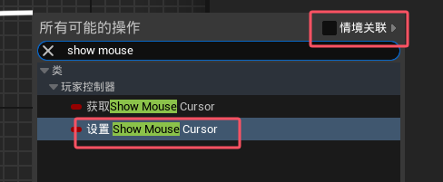
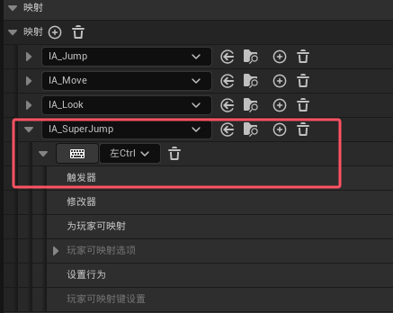
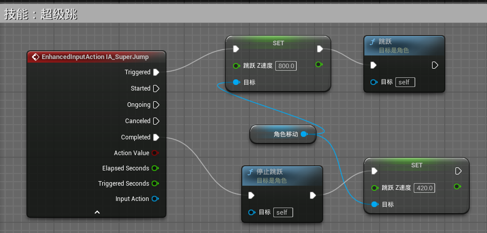

[教程地址](https://www.bilibili.com/video/BV1Za4y1s7ti/?spm_id_from=333.1387.upload.video_card.click&vd_source=8924ad59b4f62224f165e16aa3d04f00)

视频分p很零碎，选择性记一些笔记吧

# 0.安装

# 1.入门

`q`选中物体，`w`平移，`e`旋转，`r`缩放  

左键选择物体之后按`f`可以聚焦

按住右键后`z`和`c`可以拉远拉近镜头

滚轮也可以前后运镜

选中文件后`ctrl+B`可以**打开物体文件**

左上角编辑->项目设置->地图和模式->在默认地图一栏选择“编辑器开始地图”和“游戏默认地图”可以**切换默认地图**

## 1.12.玩家出生点

人物模型放置到场景点击人物后，右侧`Pawn`栏中的“自动控制玩家”选择值为`玩家0`

## 1.14.创建第一个蓝图

右键点击下侧空白处->蓝图类 就创建完成了  

进入编辑界面后，在左上角点击 添加->`Box Cillision`添加盒体触发器(用于简单碰撞的盒体)

## 1.15.编写第一段蓝图代码

选中物体后按`ctrl+E`可以进入编辑界面

选择碰撞盒体后，右侧菜单栏下拉可以找到“组件开始重叠时”和“组件结束重叠时”

## 1.16.触发火焰蓝图

做一个火焰蓝图，人靠近火焰就燃起来，离开就熄灭

找不到粒子可以搜索`cascade`

# 2.获取资源

## 2.19准备课程需要的素材

虚幻商城，从虚幻引擎界面的`Fab`页签进入

## 2.20如何使用资源

主要是如何使用不支持引擎版本的资源：在别处创建一个新的工程(使用的版本要低于自己的引擎版本)，将content文件夹下的东西复制到当前工程文件夹下

## 2.21修改游戏模式

如果在右侧找不到“世界场景设置”

## 2.26添加一个手电筒

## 2.27

导入模型、统一比例、设置碰撞等等

# 3.初涉地形

## 3.30.创造一块地

进入地形模式

或者选中物体之后输入`shift+2`

## 3.33.创造植物

`shift+3`打开植物界面

# 4.初涉视觉效果

## 4.34.指数级高度雾

左侧“放置Actor”菜单栏，选中“视觉效果”，有一个“指数级高度雾”

## 4.35.体积光

# 5.初涉粒子

## 5.40.漂浮的闪光粒子

# 6.初涉声音

## 6.41.导入音频

ue的音频格式为`.wav`

[BBC Sound Effect](https://sound-effects.bbcrewind.co.uk/)可以下载各种音频，可以选择`.wav`或`.mp3`格式

## 6.42.循环

## 6.44.给火加音效

# 7.初涉材质

## 7.45基础颜色

地面有点单调，怎么让它有更多花色

创建完成之后，把材质拖到物体上就行

## 7.48.自发光

RGB值超过1就会发光

## 7.49纹理贴图

把楼梯做成了木头材质

## 7.50.法线贴图

上面的木头太平了，不真，如何做出凹凸感？

## 7.51.导入纹理

就是把自己的图片放在物体表面作为贴花，需要`PNG`格式的图片  

可以用[这里](https://www.cleanpng.com/)的资源

## 7.52.贴花材质

## 7.53.贴花材质 - 取消接收贴花

小狗的图片贴到楼梯上去了，我们不想这样

## 7.54.制作法线贴图

如何让贴花有凹凸感  

要用到PS，我没有PS，跳过

# 8.初涉过场动画

## 8.56.创建一个镜头动画

我决定跳过制作动画的部分，后面要用到再回来看吧

# 9.角色入门

## 9.67.替换角色的骨骼网格体

这几个小节演示了如何使用新的骨骼动画

## 9.71.显示鼠标光标

找不到`Show Mouse Cursor`就把右上角的“情境关联”去掉  

遇到一些其它问题（可能也跟前面替换骨骼体跳过了有关？）这里没有成功，先跳过

## 9.72.添加注释

在蓝图里用鼠标框住键盘按C

## 9.73.Tick事件与Delta Seconds

每帧调用的事件

这里用蓝图实现了将帧之间的间隔时间求和并输出到屏幕的功能

## 9.74.鼠标滚轮控制摄像机

见视频

## 9.75.使用Clamp限制数值

`9.74`滚轮可以控制摄像机移动到无限远处，要对其距离做限制

## 9.76.操作映射

找到 编辑->项目设置->引擎->输入  

操作映射里面可以看到各个操作对应的按键输入

## 9.77.技能 - 超级跳

`9.76`里提到的输入已经废弃了，添加键盘输入方式如下：  

创建一个输入操作  

打开 ThirdPerson->Input->IMC_Default  

添加上面创建的输入操作

然后就可以给对应按键设置反馈了

