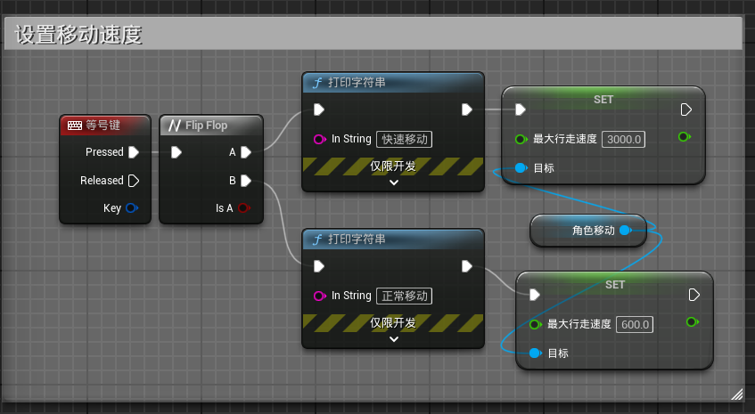
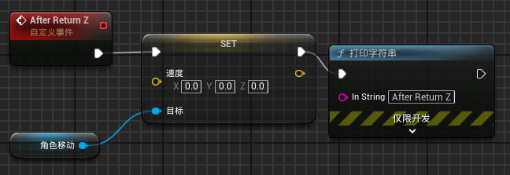

# 1.键盘输入

在TT老师的课程里，添加键盘输入的做法已经弃用了，我在其它地方找到了如何完成这件事，但还是比较麻烦  

然后发现[这个教程](https://www.bilibili.com/video/BV1PP411P7jb/?spm_id_from=333.337.search-card.all.click&vd_source=8924ad59b4f62224f165e16aa3d04f00)里的做法很方便

# 2.设置速度

+ 角色移动：`get character movement`  

+ SET：`set velocity`（要从“角色移动”牵线出去才能找到这个）

